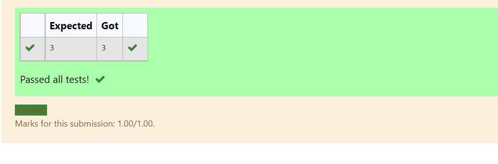

# RANK-OF-A-MATRIX
## Aim:
To write a python program to find the rank of a matrix
## Equipment’s required:
1. 	Hardware – PCs
2. 	Anaconda – Python 3.7 Installation / Moodle-Code Runner
## Algorithm:
### Step 1:
 program start
### Step 2:
 Using the np.linalg.matrix_rank(), we can find the rank of the given matrix.
### Step 3:
program running sucessfully 
## Program:
import numpy as np 
A=np.array([[5,-3,-10],[2,2,-3],[-3,-1,5]])
value=np.linalg.matrix_rank(A)
print (value)
## Output:

## Result:
Thus the rank for the given matrix is successfully solved by  using a python program.

